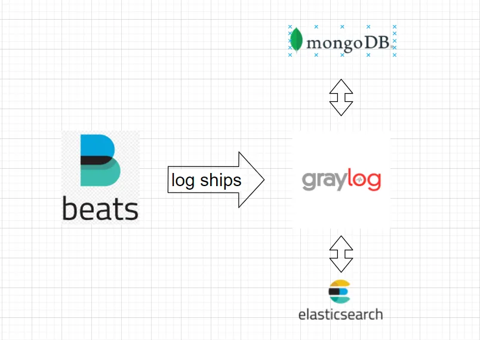

# Урок 12

## Logger

1. `docker-compose up -d`
1. http://localhost:9000/
1. System/Inputs -> Inputs -> Select input -> Beats -> Launch new input -> write your title -> Save

## Tracing

1. http://localhost:16686/

## Prometheus

1. http://localhost:9090/

## Grafana

1. http://localhost:3000/
1. See more: https://grafana.com/grafana/dashboards/

## Pprof

1. `brew install graphviz`
1. http://localhost:8084/debug/pprof/

### Profile (CPU)
1. `go tool pprof http://localhost:8084/debug/pprof/profile`
1. `go tool pprof -http=localhost:4000 <path to profile>`

### Heap
1. `go tool pprof http://localhost:8084/debug/pprof/heap`
1. `go tool pprof -http=localhost:4000 <path to profile>`

### Mutex
1. `go tool pprof http://localhost:8084/debug/pprof/mutex?debug=1`

## Директории Go

### `/cmd`

Основные приложения для текущего проекта.

Имя директории для каждого приложения должно совпадать с именем исполняемого файла, который вы хотите собрать (например, `/cmd/myapp`).

Не стоит располагать в этой директории большие объёмы кода. Если вы предполагаете дальнейшее использование кода в других проектах, вам стоит хранить его в директории `/pkg` в корне проекта. Если же код не должен быть переиспользован где-то еще - ему самое место в директории `/internal` в корне проекта.

Самой распространённой практикой является использование маленькой `main` функции, которая импортирует и вызывает весь необходимый код из директорий `/internal` и `/pkg`, но не из других.

Примеры:
- https://github.com/vmware-tanzu/velero/tree/main/cmd
- https://github.com/moby/moby/tree/master/cmd
- https://github.com/prometheus/prometheus/tree/main/cmd
- https://github.com/influxdata/influxdb/tree/master/cmd
- https://github.com/kubernetes/kubernetes/tree/master/cmd
- https://github.com/dapr/dapr/tree/master/cmd
- https://github.com/ethereum/go-ethereum/tree/master/cmd

### `/internal`

Внутренний код приложения и библиотек. Это код, который не должен использоваться в других приложениях и библиотеках. Стоит отметить, что этот шаблон применяется самим компилятором Golang. Также, вы вольны использовать более одной директории internal на разных уровнях структуры своего проекта.

Вы можете добавить дополнительное структурирование, чтобы разделить открытую и закрытую части вашего внутреннего кода. Такой подход не является обязательным (особенно для маленьких проектов), но позволяет сразу визуально оценить область применение кода. Код самого приложения может находиться в директории `/internal/app` (например, `/internal/app/myservice`).

### `/pkg`

Код библиотек, пригодных для использования в сторонних приложениях (например, `/pkg/mypubliclib`). Другие проекты будут импортировать эти библиотеки, ожидая их автономной работы, поэтому стоит подумать дважды, прежде чем класть сюда какой-нибудь код. Обратите внимание, что использование директории internal - более оптимальный способ гарантировать что ваши внутренние пакеты, не будут импортированы, потому что это обеспечивает сам Go. Директория `/pkg` - всё еще хороший путь дать понять, что код в этой директории могут безопасно использовать другие.

## Директории приложений-сервисов

### `/api`

Спецификации OpenAPI/Swagger, JSON schema файлы, файлы определения протоколов.

## Полезные материалы

### Форматирование и стилизация кода

- https://talks.golang.org/2014/names.slide
- https://golang.org/doc/effective_go.html#names
- https://blog.golang.org/package-names
- https://github.com/golang/go/wiki/CodeReviewComments
- [Руководство по стилизации кода для пакетов Golang](https://rakyll.org/style-packages/) (rakyll/JBD)

### Стандартный макет Go проекта

- https://github.com/golang-standards/project-layout/blob/master/README_ru.md#%D0%B4%D0%B8%D1%80%D0%B5%D0%BA%D1%82%D0%BE%D1%80%D0%B8%D0%B8-go

### Наименование и организация пакетов и структуру кода

- [GopherCon EU 2018: Peter Bourgon - Best Practices for Industrial Programming](https://www.youtube.com/watch?v=PTE4VJIdHPg)
- [GopherCon Russia 2018: Ashley McNamara + Brian Ketelsen - Go best practices.](https://www.youtube.com/watch?v=MzTcsI6tn-0)
- [GopherCon 2017: Edward Muller - Go Anti-Patterns](https://www.youtube.com/watch?v=ltqV6pDKZD8)
- [GopherCon 2018: Kat Zien - How Do You Structure Your Go Apps](https://www.youtube.com/watch?v=oL6JBUk6tj0)

### Чистая архитектура

- https://blog.cleancoder.com/uncle-bob/2012/08/13/the-clean-architecture.html
- https://amitshekhar.me/blog/go-backend-clean-architecture
- https://habr.com/ru/companies/oleg-bunin/articles/516500/
- https://github.com/evrone/go-clean-template/tree/master
- https://github.com/bxcodec/go-clean-arch

### Go Style Guides

- https://go.dev/doc/effective_go
- https://github.com/uber-go/guide/blob/master/style.md#uber-go-style-guide
- https://google.github.io/styleguide/go/
- https://google.github.io/styleguide/go/best-practices
