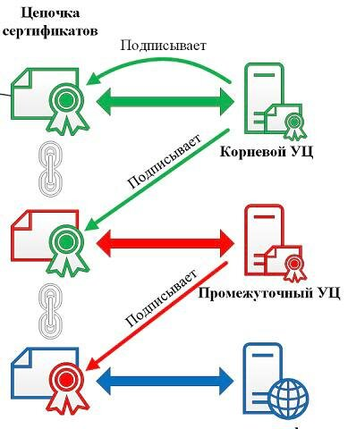

# TLS



1. Generate certificates
```sh
./cert_gen.sh
```

## HTTP

### Server

1. Run go server
```sh
go run tls/http/server/main.go
```
1. Unsafe (no TLS) call
```sh
curl -sL https://127.0.0.1:8443/hello --insecure
```
1. Safe (with TLS) call
```sh
curl -v --cacert ./cert/ca-cert.crt https://127.0.0.1:8443/hello
```
1. https://127.0.0.1:8443/hello
ВНИМАНИЕ! В браузере вы увидите предупреждение безопасности. Это означает, что сертификат на сервере не подписан доверенным центром сертификации.


### Client

1. Run HTTPS go client
```sh
go run tls/http/client/main.go
```

## gRPC (server_side_tls)

### Server

1. Run go server
```sh
go run tls/grpc/server_side_tls/server/main.go
```

### Client

1. Run HTTPS go client
```sh
go run tls/grpc/server_side_tls/client/main.go
```

## gRPC (mutual_tls)

### Server

1. Run go server
```sh
go run tls/grpc/mutual_tls/server/main.go
```

### Client

1. Run HTTPS go client
```sh
go run tls/grpc/mutual_tls/client/main.go
```